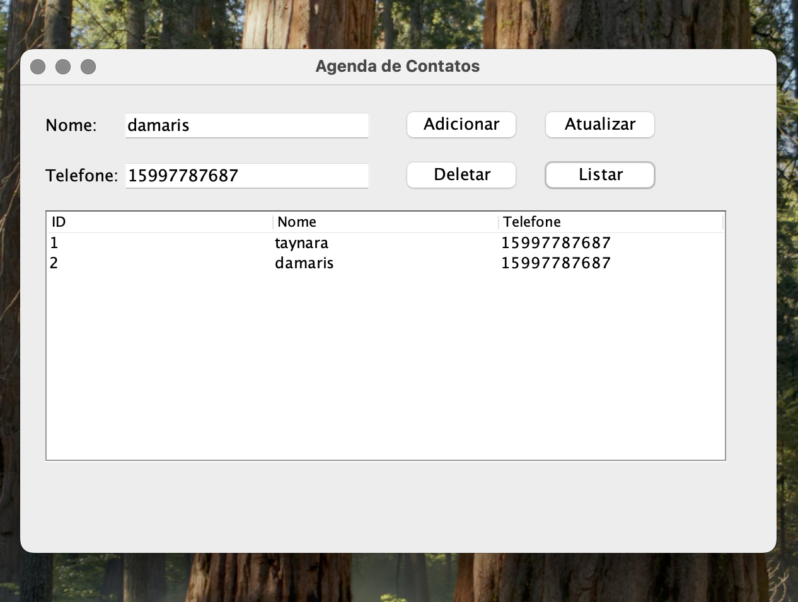
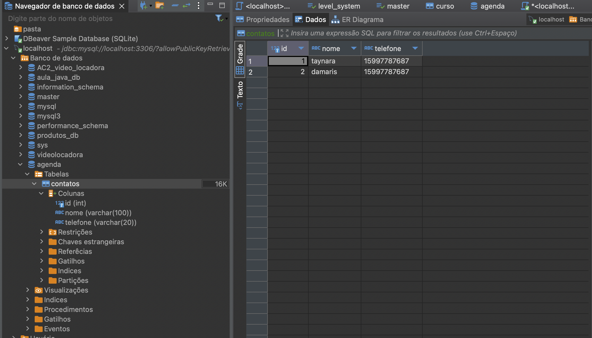

# Projeto: Agenda Pessoal

Este projeto implementa uma aplicação de **Agenda Pessoal** utilizando **Java** e **Swing** para a interface gráfica e **MySQL** como banco de dados, gerenciado por meio do **DBeaver**. A aplicação foi configurada como um projeto **Maven**, com dependências para conexão **JDBC** e gerenciamento de dados.

### 🖼️ Exemplo da Interface Gráfica



---

## 🎯 Objetivo
Criar uma agenda pessoal que permita ao usuário realizar operações básicas de CRUD (Create, Read, Update, Delete) em uma lista de contatos.

---

## 🛠️ Tecnologias Utilizadas

- **Java**: Linguagem principal para o desenvolvimento.
- **Swing**: Biblioteca utilizada para criar a interface gráfica.
- **MySQL**: Banco de dados para armazenar os contatos.
- **DBeaver**: Ferramenta de gerenciamento do banco de dados.
- **Maven**: Gerenciador de dependências e build do projeto.

---

## 📂 Estrutura do Projeto

agenda-pessoal/ 
├── src/main/java/ 
│ 
├── dao/ 
│
│ └── ContatoDAO.java # Gerenciamento de operações no banco 
│ 
├── models/ 
│ 
│ └── Contato.java # Modelo representando o contato 
│ 
├── ui/ 
│ 
│ └── MainFrame.java # Interface gráfica da aplicação 
│ 
└── Main.java # Classe principal para execução 
├── pom.xml # Configuração Maven


---

## 📑 Funcionalidades

1. **Adicionar Contato**: Insere um novo contato no banco de dados.
2. **Atualizar Contato**: Permite editar as informações de um contato existente.
3. **Deletar Contato**: Remove um contato do banco de dados.
4. **Listar Contatos**: Exibe todos os contatos registrados.

---

## 💾 Configuração do Banco de Dados

1. Configure o **DBeaver** para gerenciar o banco de dados MySQL.
2. Crie o banco de dados `agenda` com a seguinte tabela:

```sql
CREATE DATABASE agenda;

USE agenda;

CREATE TABLE contatos (
    id INT AUTO_INCREMENT PRIMARY KEY,
    nome VARCHAR(100) NOT NULL,
    telefone VARCHAR(20) NOT NULL
);
```

### 🖼️ Exemplo do Banco de Dados no DBeaver

